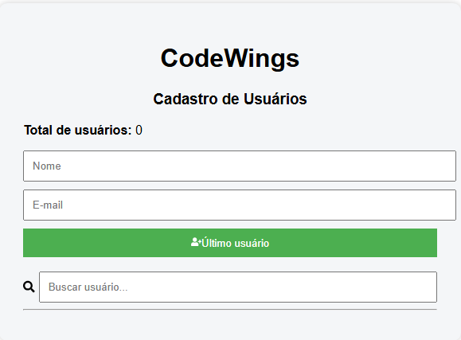

# Getting Started with Create React App

This project was bootstrapped with [Create React App](https://github.com/facebook/create-react-app).

## Available Scripts

In the project directory, you can run:

## Projeto online

https://codewings-crud-react.vercel.app

# Codewings - Cadastro de Usuários

! [React](https://img.shilds.io/badge/React-18-blue)
! [JavaScript](https://img.shilds.io/badge/JavaScript-ES6-yellow)
! [Status](https://img.shilds.io/badge/status-concluido.green)

## Interface do Sistema

🎯 Problema que o projeto resolve

O sistema permite gerenciar usuários de forma simples e organizada.

Com ele é possível cadastrar, editar, buscar e remover usuários, facilitando o controle de informações em aplicações web.

🛠 Tecnologias utilizadas

React

JavaScript

HTML

CSS

React Icons

LocalStorage

Git

GitHub

⚙️ Funcionalidades

Adicionar usuários

Editar usuários

Excluir usuários

Buscar usuários

Contador de usuários

Armazenamento no navegador

🧠 Desafios enfrentados

Durante o desenvolvimento enfrentei alguns desafios como:

Organização dos estados no React

Implementação da busca de usuários

Tratamento de erros e bugs durante a construção do sistema

Estruturação do layout da aplicação

Esses desafios ajudaram a aprofundar meu entendimento sobre desenvolvimento em React.

📚 O que aprendi

Durante esse projeto aprendi:

Como construir um CRUD completo em React

Manipulação de estados com useState

Estruturação de componentes

Uso do LocalStorage para persistência de dados

Organização de um projeto para portfólio no GitHub

Deploy de aplicações web

📦 Como executar o projeto

Clone o repositório:

git clone https://github.com/marileide09/codewings-crud-react.git

Entre na pasta do projeto:

cd codewings-crud-react

Instale as dependências:

npm install

Execute o projeto:

npm start
⭐ Autor

Projeto desenvolvido por Marileide Aparecida Santos como parte dos estudos em desenvolvimento web.

### `npm start`

Runs the app in the development mode.\
Open [http://localhost:3000](http://localhost:3000) to view it in your browser.

The page will reload when you make changes.\
You may also see any lint errors in the console.

### `npm test`

Launches the test runner in the interactive watch mode.\
See the section about [running tests](https://facebook.github.io/create-react-app/docs/running-tests) for more information.

### `npm run build`

Builds the app for production to the `build` folder.\
It correctly bundles React in production mode and optimizes the build for the best performance.

The build is minified and the filenames include the hashes.\
Your app is ready to be deployed!

See the section about [deployment](https://facebook.github.io/create-react-app/docs/deployment) for more information.

### `npm run eject`

**Note: this is a one-way operation. Once you `eject`, you can't go back!**

If you aren't satisfied with the build tool and configuration choices, you can `eject` at any time. This command will remove the single build dependency from your project.

Instead, it will copy all the configuration files and the transitive dependencies (webpack, Babel, ESLint, etc) right into your project so you have full control over them. All of the commands except `eject` will still work, but they will point to the copied scripts so you can tweak them. At this point you're on your own.

You don't have to ever use `eject`. The curated feature set is suitable for small and middle deployments, and you shouldn't feel obligated to use this feature. However we understand that this tool wouldn't be useful if you couldn't customize it when you are ready for it.

## Learn More

You can learn more in the [Create React App documentation](https://facebook.github.io/create-react-app/docs/getting-started).

To learn React, check out the [React documentation](https://reactjs.org/).

### Code Splitting

This section has moved here: [https://facebook.github.io/create-react-app/docs/code-splitting](https://facebook.github.io/create-react-app/docs/code-splitting)

### Analyzing the Bundle Size

This section has moved here: [https://facebook.github.io/create-react-app/docs/analyzing-the-bundle-size](https://facebook.github.io/create-react-app/docs/analyzing-the-bundle-size)

### Making a Progressive Web App

This section has moved here: [https://facebook.github.io/create-react-app/docs/making-a-progressive-web-app](https://facebook.github.io/create-react-app/docs/making-a-progressive-web-app)

### Advanced Configuration

This section has moved here: [https://facebook.github.io/create-react-app/docs/advanced-configuration](https://facebook.github.io/create-react-app/docs/advanced-configuration)

### Deployment

This section has moved here: [https://facebook.github.io/create-react-app/docs/deployment](https://facebook.github.io/create-react-app/docs/deployment)

### `npm run build` fails to minify

This section has moved here: [https://facebook.github.io/create-react-app/docs/troubleshooting#npm-run-build-fails-to-minify](https://facebook.github.io/create-react-app/docs/troubleshooting#npm-run-build-fails-to-minify)
