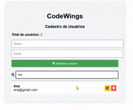

# CodeWings - Sistema de Cadastro de Usuários

Aplicação desenvolvida em React para gerenciamento de usuários com funcionalidades completas de CRUD.

---

## 🌐 Projeto online

https://codewings-crud-react.vercel.app

---

---

## 📷 Interface do Sistema

---

## 🎯 Problema que o projeto resolve

O sistema permite gerenciar usuários de forma simples e organizada.

Com ele é possível cadastrar, editar, buscar e remover usuários, facilitando o controle de informações em aplicações web.

---

## 🛠 Tecnologias utilizadas

- React
- JavaScript
- HTML
- CSS
- React Icons
- LocalStorage
- Git
- GitHub

---

## ⚙️ Funcionalidades

- Adicionar usuários
- Editar usuários
- Excluir usuários
- Buscar usuários
- Contador de usuários
- Armazenamento no navegador

---

## 🧠 Desafios enfrentados

Durante o desenvolvimento enfrentei alguns desafios como:

- Organização dos estados no React
- Implementação da busca de usuários
- Tratamento de erros e bugs durante a construção do sistema
- Estruturação do layout da aplicação

---

## 📚 O que aprendi

Durante esse projeto aprendi:

- Como construir um CRUD completo em React
- Manipulação de estados com useState
- Estruturação de componentes
- Uso do LocalStorage para persistência de dados
- Organização de um projeto para portfólio no GitHub
- Deploy de aplicações web

---

## 📦 Como executar o projeto

Clone o repositório:

git clone https://github.com/marileide09/codewings-crud-react.git

Entre na pasta do projeto:

cd codewings-crud-react

Instale as dependências:

npm install

Execute o projeto:

npm start

---

## ⭐ Autor

Projeto desenvolvido por **Marileide Aparecida Santos**.
